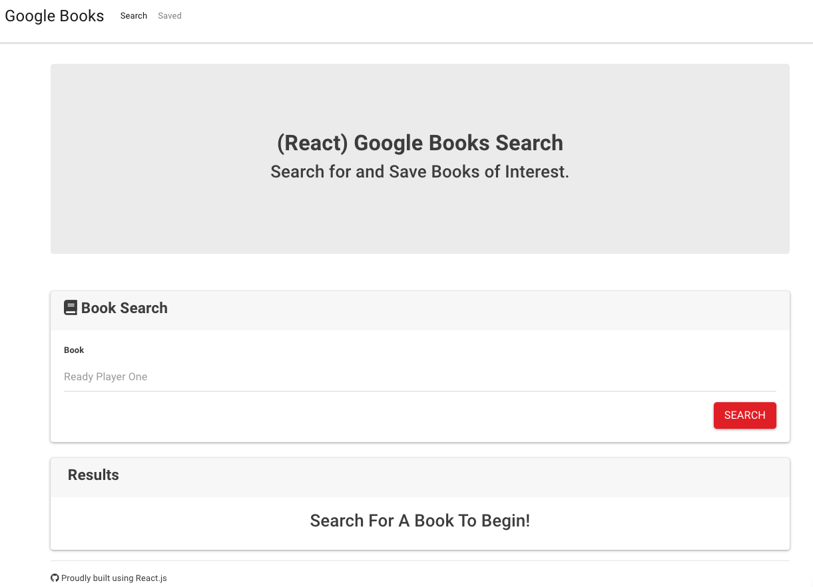
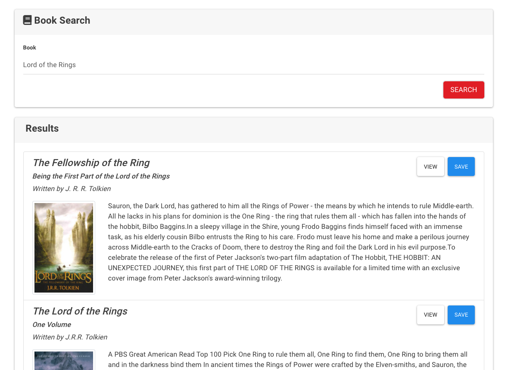
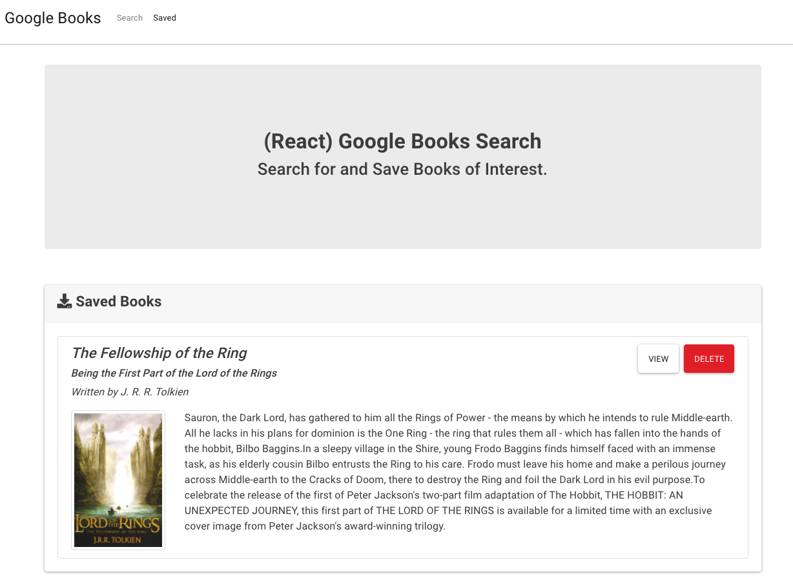

# React Google Books Search

### Deployment & Repository

- [Heroku Deployment](https://pacific-retreat-75457.herokuapp.com/)
- [Github Repository Link](https://github.com/qudoki/react-google-books)

### Technical Requirements
* Javascript
* React.js
* JSX
* Express/Node.js
* MongoDB/Mongoose

### Description: 
 This app is a React-based Google Books Search. The construction used React components, helper/util functions, and utilized React lifecycle methods to query and display books based on user searches. We also use Node, Express and MongoDB so that users can save books to review or purchase later. The front-end React app will auto-reload as it's updated via webpack dev server, and the backend Express app will auto-reload independently with nodemon. Technologies include Javascript, React.js, JSX, Express/Node.js, MongoDB and Mongoose.

# Table of Contents
- [Installation](https://github.com/qudoki/react-google-books/blob/main/README.md#installation)
- [Usage](https://github.com/qudoki/react-google-books/blob/main/README.md#usage)
- [Screenshots](https://github.com/qudoki/react-google-books/blob/main/README.md#screenshots)
- [Tests](https://github.com/qudoki/react-google-books/blob/main/README.md#usage)
- [Contributing](https://github.com/qudoki/react-google-books/blob/main/README.md#contributions)
- [Questions](https://github.com/qudoki/react-google-books/blob/main/README.md#questions)
- [License](https://github.com/qudoki/react-google-books/blob/main/README.md#license)

## Installation:
- This package requires node.js and Inquirer. You can install the package dependencies by entering the following commands: "npm install" or "npm i".

## Usage:
- There currently are no tests, but in the future, the user would run "npm test" and follow the prompts.

## Screenshots:

#### Home Page

#### Searching Books

#### Saving Books

## Contributing:
- In most cases, please refer to this document: [Contributor Covenant](https://www.contributor-covenant.org/) 

- Please contact the repository owner for collaboration.
- Please contact the owner.

## Questions:
If you have any questions, please feel free to reach me via Github or email below.

- [Github Profile](https://github.com/qudoki)
- [Email Address](qdong327@gmail.com)

 
## License: 
 MIT
[License](https://img.shields.io/badge/license-MIT-green")

    Copyright 2021 Quinn Dong-Kilkenny 

    Permission is hereby granted, free of charge, to any person obtaining a copy of this software and associated documentation files (the "Software"), to deal in the Software without restriction, including without limitation the rights to use, copy, modify, merge, publish, distribute, sublicense, and/or sell copies of the Software, and to permit persons to whom the Software is furnished to do so, subject to the following conditions:
    The above copyright notice and this permission notice shall be included in all copies or substantial portions of the Software.
    THE SOFTWARE IS PROVIDED "AS IS", WITHOUT WARRANTY OF ANY KIND, EXPRESS OR IMPLIED, INCLUDING BUT NOT LIMITED TO THE WARRANTIES OF MERCHANTABILITY, FITNESS FOR A PARTICULAR PURPOSE AND NONINFRINGEMENT. IN NO EVENT SHALL THE AUTHORS OR COPYRIGHT HOLDERS BE LIABLE FOR ANY CLAIM, DAMAGES OR OTHER LIABILITY, WHETHER IN AN ACTION OF CONTRACT, TORT OR OTHERWISE, ARISING FROM, OUT OF OR IN CONNECTION WITH THE SOFTWARE OR THE USE OR OTHER DEALINGS IN THE SOFTWARE.